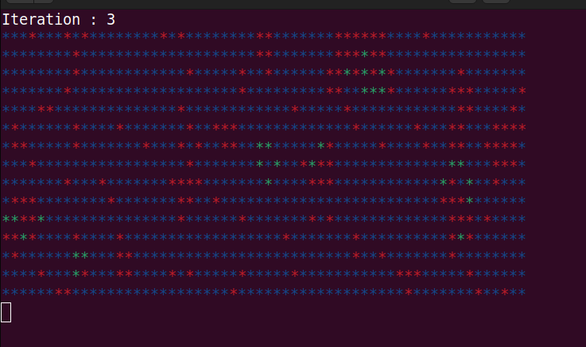

## GAME OF LIFE
```
    ++++   ++++  +     +  ++++    +    +++ ++++ ++++
    +      +  +  + + + +  +       +     +  +    +
    + +++  ++++  +  +  +  ++++    +     +  ++++ ++++
    +  +   +  +  +     +  +       +     +  +    +
    ++++   +  +  +     +  ++++    ++++ +++ +    ++++
```

## 1. Compile the source file GameOfLife.cpp
```
g++ -o game GameOfLife.cpp
```
## 2. Run the program
```
./game
```




